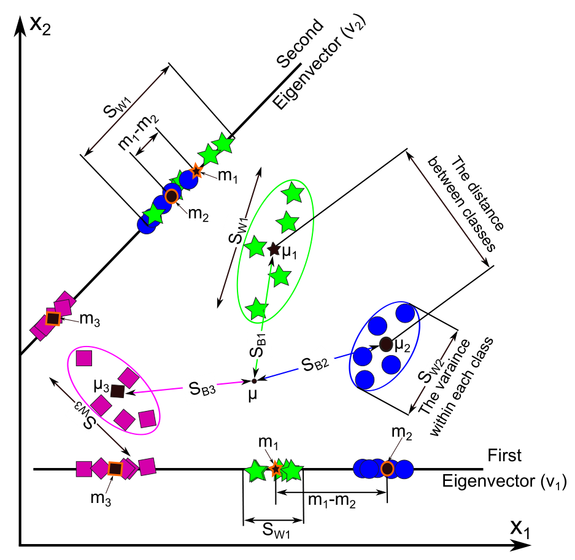

```{r setup, include=FALSE}
options(htmltools.dir.version = FALSE)
knitr::opts_chunk$set(
  fig.width=9, fig.height=3.5, fig.retina=3,
  out.width = "100%",
  cache = FALSE,
  echo = FALSE,
  message = FALSE, 
  warning = FALSE,
  hiline = TRUE
)
```

```{r xaringan-themer, include=FALSE, warning=FALSE}
library(xaringanthemer)
style_duo_accent(
  primary_color = "#1381B0",
  secondary_color = "#FF961C",
  inverse_header_color = "#FFFFFF"
)
```

```{r xaringan-Extra, include=FALSE, warning=FALSE}
library(xaringanExtra)
xaringanExtra::use_scribble()
xaringanExtra::use_tile_view()
xaringanExtra::use_progress_bar(color = "#0051BA", location = "top")
```


class: inverse center middle

# Introduction

---


## SPF Project

.pull-left[

*   in collaboration with SPF
*   high and low order explosions
*   debris collected
*   analysed with infrared spectroscopy: FTIR spectrometer
]

.pull-right[


]

---
## Experiments

.pull-left[

- KBr pellets
- mid-IR range
- multiple spectra measured
- spectral signatures from high energetic material
- ... but also from the surface material (paper, plastic, textile)
]

.pull-right[


]


---
## Motivation for this sub-project

.pull-left[

*   check which materials are more suitable as sample collectors
*   check what is the influence of the order of explosion on the classification 
*   investigate dimension reduction method in combination with discrimination
*   building classification model: combined PCA-LDA

]

.pull-right[


]


---
class: inverse center middle

# Results

---

## Spectral Data
.pull-left[

*   typically more variables than observations
*   variables are highly correlated and auto-correlated
*   before modeling need for dimension reduction
*   pre-processing
]

.pull-right[


]
---

## Pre-processing
.pull-left[


]

.pull-right[


]

---
class: inverse center middle
## Dimension Reduction

---
## How PCA works


]


---
## How PCA works

]


---
## PCA on decathlon dataset
```{r}
library("FactoMineR")
library("factoextra")
data(decathlon2)
knitr::kable(head(decathlon2[, 1:9], n=8), format = 'html')

```


---
## Correlation between variables

```{r}
decathlon2.active <- decathlon2[1:23, 1:10]
cor.mat <- round(cor(decathlon2.active),2)
library("corrplot")
corrplot(cor.mat, type="upper", order="hclust", 
         tl.col="black", tl.srt=45)
```


---
## Principal Components: screeplot and scoreplot

```{r}
res.pca <- PCA(decathlon2.active, graph = FALSE)
eigenvalues <- res.pca$eig
barplot(eigenvalues[, 2], names.arg=1:nrow(eigenvalues), 
       main = "Variances",
       xlab = "Principal Components",
       ylab = "Percentage of variances",
       col ="steelblue")
# Add connected line segments to the plot
lines(x = 1:nrow(eigenvalues), eigenvalues[, 2], 
      type="b", pch=19, col = "red")
```

---
## Loadings
```{r}
fviz_pca_var(res.pca, col.var="contrib")+
scale_color_gradient2(low="blue", mid="white", high="red")+theme_bw()
```


---
## Principal Components: screeplot and scoreplot
```{r, fig.height=4}
fviz_pca_ind(res.pca)
```


---
## Biplot
```{r, fig.height=4}
fviz_pca_biplot(res.pca,  geom = "text")
```


---
## PCA: Practical Applications

- Finance: analyze stock market data to identify patterns 
- Image compression: compress digital images 
- Genetics: analyze genetic data to identify patterns
- Social media: social media data to identify trends in user behavior and preferences
- Marketing: consumer data to identify patterns in purchasing behavior and preferences
- Healthcare: patient data to identify risk factors and predict outcomes
- Quality control: manufacturing data to identify patterns in product quality and performance
- Agriculture: crop data to identify patterns in yields and optimize farming practices
- Climate research: climate data to identify patterns in weather patterns and predict future climate trends
- Sports: player data to identify key factors that contribute to winning games and championships.


---
## PCA for spectrosopic data
.pull-left[
- dimension reduction
- removing correlation between variables
- finding patters
- unsupervised method
- *lossy technique*
- *scaling variables can yield different results*
- *problems with interpretation: PCs are linear combination of original features*
]
.pull-right[

]

---
## Loadings and contribution plot
.pull-left[

]
.pull-right[
- first two PCA
- all wavenumbers
- colour coded contribution cos<sup>2</sup> contribution to PC1 and PC2
]


---
## Scoreplots

.pull-left[

]
.pull-right[
- first two PCA
- all observations (spectra)
- colour coded class membership (explosive and order)
]


---
class: inverse center middle
## Identification/Classification/Grouping

---
## 2D partitions

---
## Building Classification Model

-  first use PCA on spectral data for dimension reduction
-  then use LDA to build the Classification Model using a first few PC's
-  test the Classification Model with new data
---
## How LDA works

.pull-left[
Source: Linear discriminant analysis : a detailed tutorial Gaber, T, Tharwat, A, Ibrahim, A and Hassanien, AE AI Communications (2017)
]

.pull-right[
```{r,out.width = "500px"}

```
]


---
## Data Preparation for LDA

- **Classification Problems** applied to classify the categorical output variable (suitable for binary and multi-class classification problems)
- **Gaussian Distribution** The standard LDA model applies the Gaussian Distribution of the input variables. One should review the univariate distribution of each variable and transform them into more Gaussian-looking distributions (use log and root for exponential distributions and Box-Cox for skewed distributions)
- **Remove Outliers** It is good to firstly remove the outliers from your data because these outliers can skew the basic statistics used to separate classes in LDA, such as the mean and the standard deviation
- **Same Variance** As LDA always assumes that all the input variables have the same variance, hence it is always a better way to firstly standardize the data before implementing an LDA model. By this, the mean will be 0, and it will have a standard deviation of 1.

---
class: inverse center middle
## LDA on principal components

---
## Discriminant functions plot
.pull-left[

]
.pull-right[
- first two linear discriminant functions
- all observations (originaly spectra) 
- colour coded class membership (explosive and order)
]

---
## Comparison

.pull-left[
### PCA
- unsupervised
- maximize the variance in the given dataset
- good performer for a comparatively small sample size

]
.pull-right[
### LDA
- supervised
- find the linear discriminants to represent the axes that maximize separation between different classes
- more suitable for multi-class classification tasks
]

---
class: inverse center middle

# Conclusions

---
## Take home message

- Spectroscopic data are multidimensional and highly correlated
--

- PCA "transfers" most variability of the system to the first few principal components
--

- PCA removes correlation between variables
--

- For classification model we need another method: LDA
--

- With PCs as input variables LDA works well in predicting the class membership
--

- We can validate model with various statistical methods, for example Leave-One-Out


---
## Where to find:

.pull-left[

### Manuscript:


]


.pull-right[

### Slides: 
https://krzbanas.github.io/2023-03-30_SSLS_Seminar


]


---
class: center, middle

# Thank You!

Slides created via the R packages:

[**xaringan**](https://github.com/yihui/xaringan)<br>
[gadenbuie/xaringanthemer](https://github.com/gadenbuie/xaringanthemer)

The chakra comes from [remark.js](https://remarkjs.com), [**knitr**](http://yihui.name/knitr), and [R Markdown](https://rmarkdown.rstudio.com).
